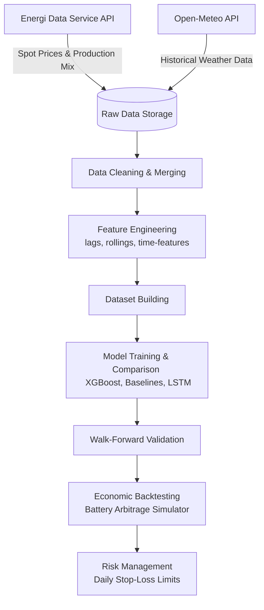

# 🔋 Denmark Electricity Spot Price Forecasting & Battery Arbitrage

A machine learning and quantitative finance project to forecast day-ahead electricity spot prices in Denmark (**DK2 bidding zone**) and simulate battery storage arbitrage strategies.

---

<p align="center">
  
  
  
  
  
</p>

---

## 📋 Project Overview

With the rapid expansion of wind and solar energy, electricity grid spot prices have become increasingly volatile. This project addresses the challenge by building a complete data, forecasting, and backtesting pipeline:
1. **Ingest** real-time electricity and weather market data in Denmark.
2. **Engineer** robust lags and rolling indicators for time-series forecasting.
3. **Train & Validate** machine learning models (XGBoost, LSTM) against classic baseline models.
4. **Simulate** battery arbitrage performance on historical DK2 price structures under strict risk management limits.

---

## ⚙️ Pipeline Architecture

The workflow is designed as a modular pipeline:



---

## 📊 Modeling & Performance

Forecasting models were evaluated on the **DK2 bidding zone** against rolling statistics and lag baselines.

### 1. Next-Hour Price Forecasting
Predicting price $y_{t+1}$ using historical data up to $t$:

| Model | MAE (EUR/MWh) | RMSE (EUR/MWh) |
| :--- | :---: | :---: |
| **XGBoost (Optimal)** | **9.78** | **16.56** |
| Current Price Baseline | 14.62 | 24.98 |
| Lag 24h Baseline | 31.85 | 46.71 |
| Lag 168h Baseline | 33.83 | 50.63 |
| Rolling Mean 24h | 34.51 | 45.80 |

### 2. 24h-Ahead Price Forecasting
Predicting the price 24 hours in advance (essential for day-ahead market bidding):

| Model | MAE (EUR/MWh) | RMSE (EUR/MWh) |
| :--- | :---: | :---: |
| **XGBoost 24h** | **25.58** | **34.89** |
| Current Price Baseline | 28.30 | 42.29 |
| Rolling Mean 168h | 37.69 | 49.88 |
| Rolling Mean 24h | 40.72 | 53.81 |

### 📈 Feature Importance (Top Predictors)
XGBoost model interpretations show that the following features have the highest predictive power:
1. **SpotPriceEUR** (Most recent spot price lag)
2. **net_load_mwh** (Total load minus wind/solar generation)
3. **CommercialPowerMWh** (Commercial generation schedules)
4. **solar_mwh / shortwave_radiation** (Solar indicators)
5. **ExchangeGreatBelt_MWh** (Interconnector transmission schedules)

---

## 🔋 Battery Arbitrage Backtesting & Risk Management

We backtested a physical battery storage system trading on the day-ahead spot market using a simple threshold strategy:
* **Position Size**: 1.0 MWh
* **Trade Signal**: Buy if Expected Spread > €10; Sell if Expected Spread < -€10.

### 💰 Backtest Performance Summary
Evaluating the period **Feb 13, 2025 – Sep 25, 2025** (~7.5 months):

| Metric | Original Strategy | Risk-Controlled Strategy (€-500 Daily Stop) |
| :--- | :---: | :---: |
| **Total Profit (PnL)** | **€94,298.72** | **€94,432.16** |
| **Number of Trades** | 3,787 | 3,787 |
| **Win Rate (Trades)** | 74.31% | 74.31% |
| **Average Profit/Trade** | €24.90 | €24.90 |
| **Max Drawdown** | -€793.74 | -€793.74 |
| **Best Trading Day** | €2,716.90 | €2,716.90 |
| **Worst Trading Day** | -€720.76 | -€500.00 (Stop Loss Triggered) |
| **Win Days Percentage** | 84.44% | 84.85% |

---

## 📂 Project Structure

```
denmark-electricity-price-forecasting/
├── data/
│   ├── external/               # External datasets (KNMI, grid maps)
│   ├── processed/              # Merged and cleaned weather/price features
│   └── raw/                    # Raw downloads from APIs (prices, weather, load)
├── notebooks/                  # Step-by-step EDA & Model training scripts
├── src/                        # Modular source code
│   ├── fetch_prices.py         # Pulls Danish spot prices from EDS API
│   ├── fetch_production.py     # Pulls grid settlement / load data
│   └── fetch_weather.py        # Fetches Open-Meteo weather datasets
├── reports/                    # Performance CSVs and plots
│   └── model_comparison_DK2.csv
└── requirements.txt            # Package dependencies
```

---

## 📓 Notebook Directory Index

To reproduce the analysis or explore specific pipeline steps, run the Jupyter Notebooks in sequence:

| Notebook | Description |
|---|---|
| [`01_eda_prices.ipynb`](notebooks/01_eda_prices.ipynb) | Exploratory analysis of spot price statistics and distribution. |
| [`02_clean_production_consumption.ipynb`](notebooks/02_clean_production_consumption.ipynb) | Aggregating grid production metrics (wind, solar, thermal). |
| [`03_prices_feature_engineering_DK2.ipynb`](notebooks/03_prices_feature_engineering_DK2.ipynb) | Engineering lag features, rolling windows, and time steps. |
| [`04_build_final_dataset_DK2.ipynb`](notebooks/04_build_final_dataset_DK2.ipynb) | Merging weather, production, and engineered price features. |
| [`05_baseline_model_DK2.ipynb`](notebooks/05_baseline_model_DK2.ipynb) | Evaluating naive and rolling statistical baselines. |
| [`06_xgboost_model_DK2.ipynb`](notebooks/06_xgboost_model_DK2.ipynb) | Next-Hour XGBoost model training and hyperparameter search. |
| [`07_forecast_horizon_24h_DK2.ipynb`](notebooks/07_forecast_horizon_24h_DK2.ipynb) | 24h-Ahead Multi-step XGBoost model implementation. |
| [`08_lstm_model_DK2.ipynb`](notebooks/08_lstm_model_DK2.ipynb) | Deep Learning LSTM model for sequential spot price modeling. |
| [`09_walk_forward_validation_DK2.ipynb`](notebooks/09_walk_forward_validation_DK2.ipynb) | Robust walk-forward validation (Out-of-sample simulation). |
| [`10_leakage_audit_DK2.ipynb`](notebooks/10_leakage_audit_DK2.ipynb) | Code validation audit to prevent look-ahead bias. |
| [`11_feature_sets_summary_DK2.ipynb`](notebooks/11_feature_sets_summary_DK2.ipynb) | Impact analysis of different features on model metrics. |
| [`12_model_comparison_DK2.ipynb`](notebooks/12_model_comparison_DK2.ipynb) | Aggregated comparison of ML and DL models. |
| [`13_economic_backtesting_DK2.ipynb`](notebooks/13_economic_backtesting_DK2.ipynb) | Running the battery arbitrage trading simulation. |
| [`14_risk_management_DK2.ipynb`](notebooks/14_risk_management_DK2.ipynb) | Stress testing PnL using daily stop-losses and drawdowns. |

---

## 🚀 Setup & Execution

### 1. Clone the repository
```bash
git clone https://github.com/your-username/denmark-electricity-price-forecasting.git
cd denmark-electricity-price-forecasting
```

### 2. Set up environment
Create a virtual environment and install dependencies:
```bash
python -m venv .venv
source .venv/bin/activate  # On Windows use: .venv\Scripts\activate
pip install -r requirements.txt
```

### 3. Fetch Raw Data
Run the scripts in `src/` to update your data directory:
```bash
# Fetch prices
python src/fetch_prices.py

# Fetch weather data
python src/fetch_weather.py

# Fetch grid settlement data
python src/fetch_production_consumption.py
```
