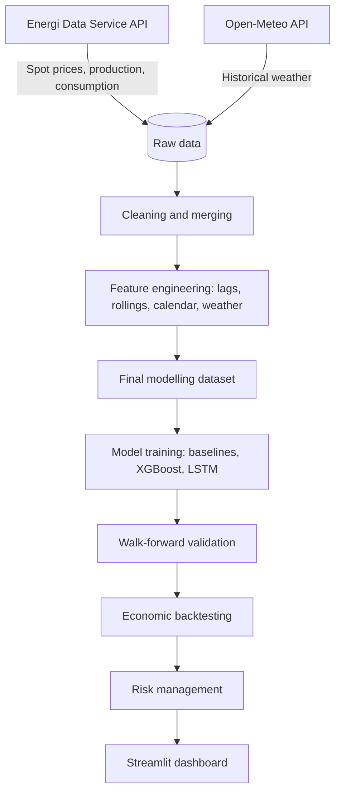

# Denmark Electricity Spot Price Forecasting & Battery Arbitrage

A machine learning and quantitative finance project to forecast day-ahead electricity spot prices in Denmark's DK2 bidding zone and simulate battery storage arbitrage strategies.

The project is structured as a quant-engineering portfolio project: data ingestion, time-series feature engineering, predictive modelling, leakage-aware validation, economic backtesting, risk controls, and a deployable Streamlit dashboard.

## Project Overview

Electricity spot prices have become increasingly volatile as wind and solar generation expand. This project builds a complete research pipeline:

1. Ingest electricity market, production, consumption, and weather data.
2. Engineer lag, rolling, calendar, weather, and energy-system features.
3. Train and compare baseline, XGBoost, and LSTM forecasting models.
4. Validate forecasts with expanding walk-forward testing.
5. Backtest a battery arbitrage strategy on DK2 price forecasts.
6. Report risk metrics such as drawdown, daily PnL, stop-loss effects, and win rates.

## Pipeline Architecture



## Results Snapshot

| Area | Result |
|---|---:|
| Best realistic forecast | Walk-forward XGBoost |
| Forecast horizon | 24 hours ahead |
| Walk-forward MAE | 25.48 EUR/MWh |
| Walk-forward RMSE | 34.04 EUR/MWh |
| Baseline MAE | 28.85 EUR/MWh |
| Backtested PnL | 94,298.72 EUR |
| Trades | 3,787 |
| Trade win rate | 74.31% |
| Win days | 84.44% |
| Max drawdown | -793.74 EUR |

## Modeling & Performance

Forecasting models were evaluated on DK2 against persistence and rolling statistical baselines.

### Next-Hour Price Forecasting

Predicting price at `t + 1` using information available up to `t`.

| Model | MAE (EUR/MWh) | RMSE (EUR/MWh) |
|---|---:|---:|
| XGBoost | 14.12 | 39.48 |
| Current price baseline | 12.31 | 24.48 |

The next-hour persistence baseline is very strong, and the ML model does not outperform it in the final comparison.

### 24-Hour-Ahead Price Forecasting

Predicting the price 24 hours ahead, which is more relevant for day-ahead bidding.

| Model | Validation | MAE (EUR/MWh) | RMSE (EUR/MWh) |
|---|---|---:|---:|
| Walk-forward XGBoost | Expanding walk-forward | 25.48 | 34.04 |
| Current price baseline | Expanding walk-forward | 28.85 | 41.83 |
| XGBoost | Fixed split | 25.38 | 34.53 |
| PyTorch LSTM | Fixed split | 34.43 | 46.71 |

## Feature Set Comparison

| Feature set | Features | MAE | RMSE |
|---|---:|---:|---:|
| All features | 32 | 25.05 | 34.41 |
| Price + calendar | 13 | 25.13 | 35.02 |
| Price + energy | 27 | 25.15 | 34.67 |
| Price + weather | 18 | 25.61 | 34.84 |
| Price only | 8 | 26.62 | 36.97 |
| Calendar only | 5 | 28.00 | 37.72 |
| Current price baseline | 1 | 28.30 | 42.29 |

## Battery Arbitrage Backtesting & Risk Management

The economic layer translates forecast signals into a simple battery arbitrage strategy.

- Position size: 1.0 MWh
- Main threshold: 10 EUR/MWh
- Signal: trade only when the expected spread is large enough to clear the threshold

| Metric | Original Strategy | Risk-Controlled Strategy |
|---|---:|---:|
| Total PnL | 94,298.72 EUR | 94,432.16 EUR |
| Number of trades | 3,787 | 3,787 |
| Trade win rate | 74.31% | 74.31% |
| Average PnL/trade | 24.90 EUR | 24.90 EUR |
| Max drawdown | -793.74 EUR | -793.74 EUR |
| Best trading day | 2,716.90 EUR | 2,716.90 EUR |
| Worst trading day | -720.76 EUR | -500.00 EUR daily stop |
| Win days | 84.44% | 84.85% |

## Dashboard

The repository includes a Streamlit dashboard that summarizes the main modelling, backtesting, and risk outputs.

```bash
streamlit run app/streamlit_app.py
```

The dashboard reads generated CSV files from `reports/` when they exist locally. If those files are missing, it falls back to portfolio-safe headline metrics so the deployed app still works without private or heavy data files.

## Deployment

This repository is ready to deploy on Streamlit Community Cloud.

1. Push the repository to GitHub.
2. Create a new app in Streamlit Community Cloud.
3. Select this repository.
4. Use this entry point:

```text
app/streamlit_app.py
```

No private datasets are required for the deployed dashboard.

## Data Sources

- [Energi Data Service](https://www.energidataservice.dk/) for spot prices, production, consumption, and load data.
- [Open-Meteo](https://open-meteo.com/) for historical weather features such as wind speed, irradiance, and temperature.

Raw and processed datasets are intentionally excluded from git. Generated report CSV files are also ignored by default because they can be regenerated from the notebooks.

## Repository Structure

```text
denmark-electricity-price-forecasting/
├── app/
│   └── streamlit_app.py
├── data/
│   ├── external/.gitkeep
│   ├── processed/.gitkeep
│   └── raw/.gitkeep
├── notebooks/
│   ├── 01_eda_prices.ipynb
│   ├── 02_clean_production_consumption.ipynb
│   ├── 03_prices_feature_engineering_DK2.ipynb
│   ├── 04_build_final_dataset_DK2.ipynb
│   ├── 05_baseline_model_DK2.ipynb
│   ├── 06_xgboost_model_DK2.ipynb
│   ├── 07_forecast_horizon_24h_DK2.ipynb
│   ├── 08_lstm_model_DK2.ipynb
│   ├── 09_walk_forward_validation_DK2.ipynb
│   ├── 10_leakage_audit_DK2.ipynb
│   ├── 11_feature_sets_summary_DK2.ipynb
│   ├── 12_model_comparison_DK2.ipynb
│   ├── 13_economic_backtesting_DK2.ipynb
│   └── 14_risk_management_DK2.ipynb
├── reports/
├── src/
│   ├── fetch_prices.py
│   ├── fetch_production_consumption.py
│   └── fetch_weather.py
├── .env.example
├── .gitignore
├── README.md
└── requirements.txt
```

## Notebook Directory Index

| Step | Notebook | Purpose |
|---|---|---|
| 1 | `01_eda_prices.ipynb` | Exploratory analysis of DK electricity prices. |
| 2 | `02_clean_production_consumption.ipynb` | Clean production and consumption inputs. |
| 3 | `03_prices_feature_engineering_DK2.ipynb` | Build price, lag, calendar, weather, and energy-system features. |
| 4 | `04_build_final_dataset_DK2.ipynb` | Assemble the final modelling dataset. |
| 5 | `05_baseline_model_DK2.ipynb` | Evaluate simple persistence and rolling baselines. |
| 6 | `06_xgboost_model_DK2.ipynb` | Train and evaluate XGBoost models. |
| 7 | `07_forecast_horizon_24h_DK2.ipynb` | Move from next-hour to 24-hour-ahead forecasting. |
| 8 | `08_lstm_model_DK2.ipynb` | Benchmark a sequential LSTM model. |
| 9 | `09_walk_forward_validation_DK2.ipynb` | Run expanding-window out-of-sample validation. |
| 10 | `10_leakage_audit_DK2.ipynb` | Audit features and validation logic for look-ahead leakage. |
| 11 | `11_feature_sets_summary_DK2.ipynb` | Compare feature families. |
| 12 | `12_model_comparison_DK2.ipynb` | Aggregate final model comparisons. |
| 13 | `13_economic_backtesting_DK2.ipynb` | Run battery arbitrage backtests. |
| 14 | `14_risk_management_DK2.ipynb` | Stress test PnL, drawdowns, and daily stop-loss rules. |

## Setup

```bash
git clone https://github.com/Ivo196/denmark-electricity-price-forecasting.git
cd denmark-electricity-price-forecasting

python -m venv .venv

# Windows PowerShell
.venv\Scripts\Activate.ps1

# macOS/Linux
source .venv/bin/activate

pip install -r requirements.txt
```

If you want to regenerate the data, copy the environment template and add any required API configuration:

```bash
cp .env.example .env
```

## Fetch Raw Data

```bash
python src/fetch_prices.py
python src/fetch_weather.py
python src/fetch_production_consumption.py
```

## Next Engineering Improvements

- Move training, validation, and backtesting logic from notebooks into reusable modules under `src/`.
- Add a command-line workflow for data build, model training, validation, and report generation.
- Add unit tests for feature generation, leakage checks, and backtest accounting.
- Add latency benchmarks for feature generation and model inference.
- Add CI to run formatting, tests, and a Streamlit smoke test.
